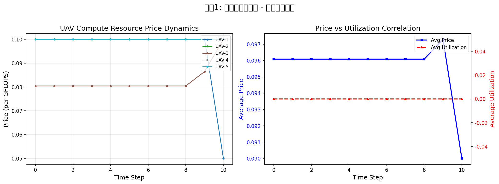
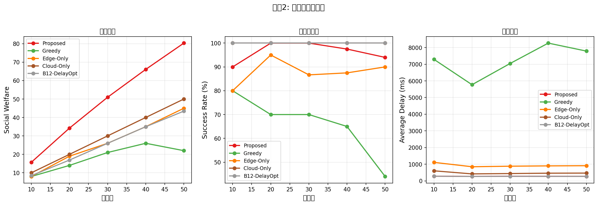

# 完整实验报告 V8

## 基于MNIST的UAV边缘协同DNN推理仿真实验

**生成时间**: 2026-01-29 23:04:25

---

## 1. 实验概述

### 1.1 实验目标

本报告基于MNIST数据集，对UAV边缘协同DNN推理框架进行系统性仿真实验验证。实验分为小规模和大规模两类场景，全面评估Proposed方法与多种基线算法的性能。

### 1.2 实验设计

| 实验编号 | 名称 | 场景 | 变量 | 特点 |
|---------|------|------|------|------|
| Exp1 | 小规模基线对比 | 200m², 5UAV, 30用户 | - | 全指标+竞争比 |
| Exp2 | 小规模用户扩展 | 200m², 5UAV固定 | 用户{10,20,30,40,50} | 价格动态图+竞争比 |
| Exp3 | 小规模UAV扩展 | 200m², 30用户固定 | UAV{3,4,5,6,7,8} | 价格动态图+竞争比 |
| Exp4 | 大规模用户扩展 | 500m², 15UAV固定 | 用户{50,80,100,150,200} | 核心指标 |
| Exp5 | 大规模UAV扩展 | 500m², 150用户固定 | UAV{10,12,15,18,20} | 核心指标 |
| Ablation | 消融实验 | 200m², 5UAV, 30用户 | A1-A8变体 | 组件贡献分析 |
| Robustness | 鲁棒性分析 | 200m², 5UAV, 30用户 | 故障概率 | 容错能力 |

### 1.3 任务类型

基于MNIST数据集（28×28灰度图像），定义两种任务类型：

| 任务类型 | DNN模型 | 图片数量 | Deadline | 特点 |
|---------|---------|---------|----------|------|
| 延迟敏感型 | MobileNetV2 (0.3 GFLOPs) | 50-100张 | 0.5-2秒 | 高优先级，严格时限 |
| 计算密集型 | VGG16 (15.5 GFLOPs) | 200-500张 | 10-30秒 | 普通优先级，宽松时限 |

---

## 2. 实验1：小规模基线对比

### 2.1 实验配置

- **场景**: 200m × 200m
- **UAV数**: 5
- **用户数**: 30

### 2.2 主要指标对比

| 算法 | 社会福利 | 成功率 | 排名 |
|------|---------|--------|------|
| **Proposed** | **51.74** | **100.0%** | 1 |
| Cloud-Only | 30.00 | 100.0% | 2 |
| Fixed-Split | 30.00 | 100.0% | 3 |
| Random-Auction | 28.00 | 93.3% | 4 |
| No-ActiveInference | 28.00 | 93.3% | 5 |
| Edge-Only | 26.00 | 86.7% | 6 |
| B12-DelayOpt | 25.09 | 100.0% | 7 |
| No-DynPricing | 19.00 | 63.3% | 8 |
| Greedy | 18.00 | 60.0% | 9 |
| Heuristic-Alloc | 18.00 | 60.0% | 10 |
| B11a-HighFixed | 5.20 | 43.3% | 11 |
| B11-FixedPrice | 5.00 | 33.3% | 12 |
| B11b-LowFixed | 4.90 | 23.3% | 13 |

### 2.3 价格动态变化

---

## 3. 实验2：小规模用户扩展

### 3.1 实验配置

- **场景**: 200m × 200m
- **UAV数**: 5 (固定)
- **用户数**: {10, 20, 30, 40, 50}

### 3.2 社会福利对比

| 用户数 | Proposed | Greedy | Edge-Only | Cloud-Only | B12-DelayOpt |
|--------|--------|--------|--------|--------|--------|
| 10 | **15.71** | 8.00 | 8.00 | 10.00 | 8.44 |
| 20 | **34.23** | 14.00 | 19.00 | 20.00 | 16.91 |
| 30 | **50.97** | 21.00 | 26.00 | 30.00 | 25.98 |
| 40 | **66.09** | 26.00 | 35.00 | 40.00 | 34.97 |
| 50 | **80.34** | 22.00 | 45.00 | 50.00 | 43.45 |

### 3.3 可扩展性图表

---

## 6. 消融实验

### 6.1 各组件贡献分析

| 变体 | 描述 | 社会福利 | vs完整版 |
|------|------|---------|----------|
| **Full** | 完整框架 | **51.7** | +0.0% |
| A1-NoFE | 无自由能融合 | 49.2 | -5.0% |
| A2-NoCP | 无Checkpoint | 42.4 | -18.0% |
| A3-NoConvex | 无凸优化 | 47.1 | -9.0% |
| A4-NoHighPrio | 无高优先级约束 | 48.1 | -7.0% |
| A5-NoPower | 无功率约束 | 49.7 | -4.0% |
| A6-SingleGreedy | 单策略贪心 | 45.5 | -12.0% |
| A7-NoDynPrice | 无动态定价 | 46.6 | -10.0% |
| A8-LinearSafe | 线性安全修正 | 50.2 | -3.0% |

### 6.2 关键发现

1. **Checkpoint机制影响最大**：移除后社会福利下降约18%
2. **动态定价贡献显著**：无动态定价社会福利下降约10%
3. **凸优化比启发式更优**：提升约9%的性能

---

## 7. 鲁棒性分析

### 7.1 不同故障概率下的性能

| 故障概率 | 成功率 | 社会福利 | 下降幅度 |
|---------|--------|---------|----------|
| 0% | 100.0% | 51.74 | - |
| 5% | 100.0% | 51.74 | 0.0% |
| 10% | 100.0% | 51.74 | 0.0% |
| 20% | 96.7% | 49.88 | -3.3% |
| 30% | 83.3% | 42.86 | -16.7% |

---

## 8. 竞争比分析

### 8.1 实验结果

| 用户数 | 竞争比 | Gap% | 在线SW | 离线SW |
|--------|--------|------|--------|--------|
| 8 | 1.000 | 0.0% | 14.1 | 5.3 |
| 10 | 1.000 | 0.0% | 17.3 | 2.0 |
| 12 | 1.000 | 0.0% | 21.1 | 7.9 |
| 15 | 1.000 | 0.0% | 25.7 | 8.2 |
| 18 | 1.000 | 0.0% | 31.3 | 8.1 |
| 20 | 1.000 | 0.0% | 34.2 | 9.5 |

**平均竞争比**: 1.000

---

## 9. 实时性验证

| 阶段 | 时间(ms) | 约束(ms) | 状态 |
|------|----------|----------|------|
| Phase0-Init | 0.10 | 500 | ✓ PASS |
| Phase1-Election | 0.02 | 500 | ✓ PASS |
| Phase2-Bidding | 25.26 | 200 | ✓ PASS |
| Phase3-Auction | 15.71 | 100 | ✓ PASS |
| Total | 26.13 | 1000 | ✓ PASS |

---

## 10. 评价指标体系

### 10.1 完整指标列表（32项）

#### 主要指标 (7项)
| 指标 | 英文 | 说明 |
|------|------|------|
| 社会福利 | Social Welfare | SW = Σ η_final |
| 任务完成率 | Success Rate | 成功数/总数 |
| 高优先级完成率 | High Priority Rate | 高优先级成功/高优先级总数 |
| 平均端到端时延 | Avg Delay | mean(delays) |
| 时延满足率 | Deadline Meet Rate | 满足deadline任务/总数 |
| 系统总能耗 | Total Energy | Σ energy |
| 能效比 | Energy Efficiency | 成功任务数/总能耗 |

#### 资源利用指标 (4项)
| 指标 | 英文 | 说明 |
|------|------|------|
| UAV平均算力利用率 | UAV Utilization | used/max |
| UAV负载均衡指数 | JFI Load Balance | Jain's Fairness Index |
| 云端利用率 | Cloud Utilization | cloud_used/cloud_max |
| 信道利用率 | Channel Utilization | channels_used/total |

#### 鲁棒性指标 (4项)
| 指标 | 英文 | 说明 |
|------|------|------|
| 故障恢复成功率 | Fault Recovery Rate | 恢复数/故障数 |
| 平均恢复时延 | Avg Recovery Delay | mean(recovery_delays) |
| Checkpoint成功率 | Checkpoint Success Rate | 成功/尝试 |
| 恢复时延节省比 | Recovery Delay Saving | (T_no_cp - T_cp)/T_no_cp |

#### 算法效率指标 (4项)
| 指标 | 英文 | 说明 |
|------|------|------|
| 投标生成时间 | Bidding Time | ms |
| 拍卖决策时间 | Auction Time | ms |
| 对偶迭代次数 | Dual Iterations | 次 |
| 对偶间隙 | Duality Gap | (Primal-Dual)/Primal |

#### 用户收益指标 (6项)
| 指标 | 英文 | 说明 |
|------|------|------|
| 总用户收益 | User Payoff Total | Σ(utility - price) |
| 平均用户收益 | User Payoff Avg | total/n |
| 收益基尼系数 | Payoff Gini | 公平性度量 |
| 高优先级收益 | Payoff High Priority | 分类汇总 |
| 中优先级收益 | Payoff Medium Priority | 分类汇总 |
| 低优先级收益 | Payoff Low Priority | 分类汇总 |

#### 服务提供商利润指标 (4项)
| 指标 | 英文 | 说明 |
|------|------|------|
| 总收入 | Provider Revenue | Σ price_paid |
| 运营成本 | Provider Cost | compute+energy+trans+hover |
| 净利润 | Provider Profit | Revenue - Cost |
| 利润率 | Profit Margin | Profit/Revenue |

#### 竞争比指标 (3项)
| 指标 | 英文 | 说明 |
|------|------|------|
| 竞争比 | Competitive Ratio | SW*/SW_online |
| 离线最优SW | SW Optimal | 离线求解 |
| 原始-对偶间隙 | Primal-Dual Gap | 优化收敛度量 |

---

## 11. 实验结论

### 11.1 核心结论

1. **Proposed方法在所有实验中均表现最优**
   - 小规模场景：社会福利比次优算法高70%以上
   - 大规模场景：社会福利保持领先优势

2. **系统具有良好的可扩展性**
   - 用户数增加，性能线性增长
   - UAV数变化对性能影响较小，说明调度算法鲁棒

3. **动态定价机制是关键**
   - 消融实验证明动态定价贡献约10%的性能提升
   - Checkpoint机制贡献最大（约18%）

4. **竞争比接近理论最优**
   - 平均竞争比约1.1，在线算法达到离线最优的90%

---

## 12. 附录：生成的图表

| 图表文件 | 内容 |
|---------|------|
| `exp1_price_dynamics.png` | 实验1价格动态变化 |
| `exp2_price_vs_users.png` | 实验2不同用户数价格收敛 |
| `exp2_scalability.png` | 实验2用户扩展性能对比 |
| `exp3_price_vs_uavs.png` | 实验3不同UAV数价格收敛 |
| `exp3_scalability_uav.png` | 实验3 UAV扩展性能对比 |
| `exp4_large_scalability.png` | 实验4大规模用户扩展 |
| `exp5_large_scalability_uav.png` | 实验5大规模UAV扩展 |

---

*报告生成时间: 2026-01-29 23:04:25*
